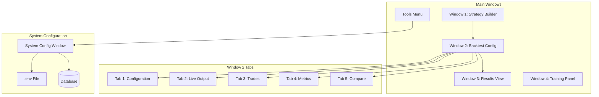
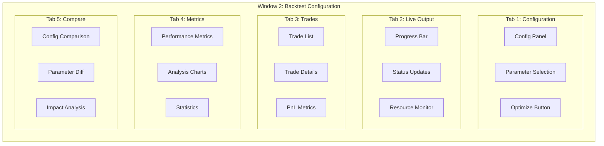
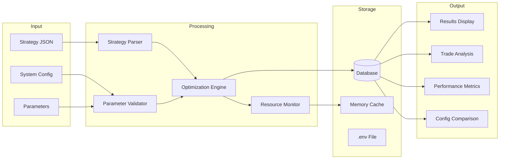
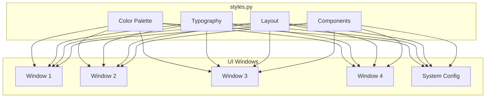
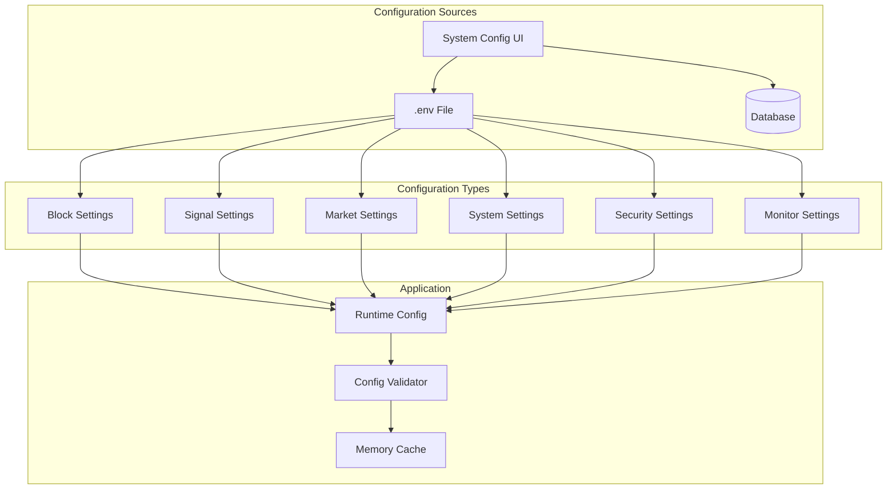
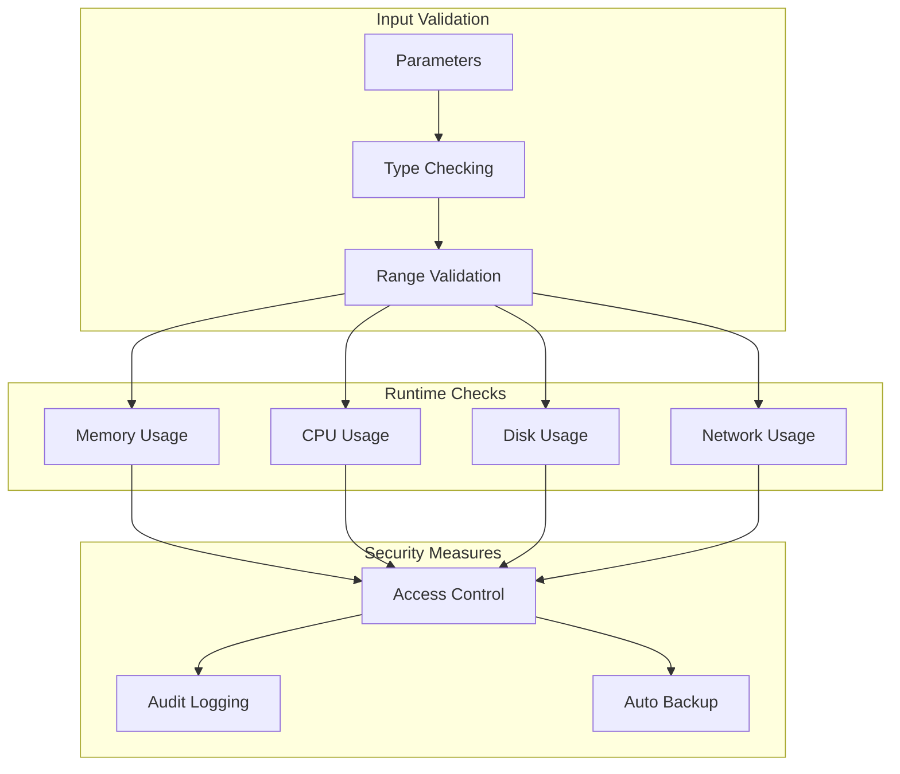
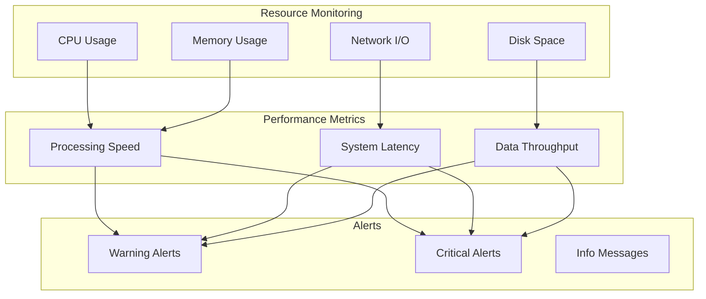

# OPTIMIZER V3 - SYSTEM FLOW DIAGRAM
**Visual Representation of System Architecture & UI Integration**

**Date**: 2026-01-20  
**Status**: 🎨 DESIGN PHASE  
**Purpose**: Visualize complete system flow including UI sections

## 🔄 SYSTEM OVERVIEW



## 🎯 OPTIMIZATION WORKFLOW

```mermaid
sequenceDiagram
    participant User
    participant W2 as Window 2
    participant Opt as Optimizer
    participant DB as Database
    participant Sys as System Config

    User->>W2: Open Backtest Config
    User->>Sys: Configure Parameters
    Sys->>DB: Save Configuration
    User->>W2: Select Strategy
    User->>W2: Click Optimize
    W2->>Opt: Start Optimization
    
    loop For Each Config
        Opt->>DB: Load Parameters
        Opt->>W2: Update Progress (Tab 2)
        Opt->>DB: Store Results
    end
    
    Opt->>W2: Display Results (Tab 3-5)
    User->>W2: Review Results
    User->>W2: Apply Optimal Config
```

## 🖥️ UI COMPONENT HIERARCHY



## 🔄 DATA FLOW



## 🎨 UI STYLING FLOW



## 📊 CONFIGURATION FLOW



## 🔐 SECURITY FLOW



## 📈 MONITORING INTEGRATION



## 🎯 IMPLEMENTATION NOTES

1. **Window Integration**
   - All windows share central styles.py
   - Consistent dark theme throughout
   - Proper spacing and alignment
   - Responsive layouts

2. **Data Management**
   - Centralized configuration
   - Database-backed persistence
   - Memory-efficient caching
   - Proper cleanup

3. **Security**
   - Input validation
   - Resource monitoring
   - Access control
   - Audit logging

4. **Performance**
   - Parallel processing
   - Memory optimization
   - Disk usage control
   - Network efficiency

---

**Status**: 🎨 Ready for implementation  
**Next Step**: Begin with System Configuration window implementation
